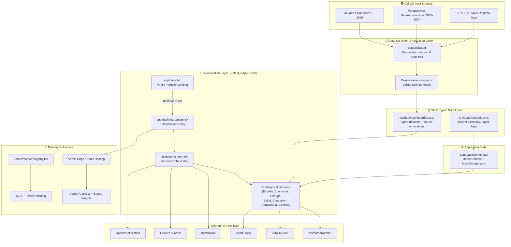
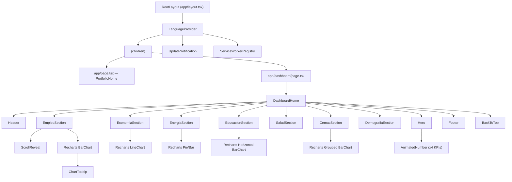
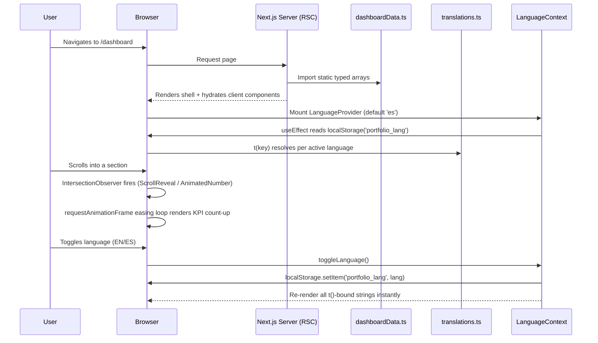

# 🇬🇶 GE en Datos — Equatorial Guinea Macroeconomic & Business Intelligence Dashboard

**An enterprise-grade, bilingual, data-driven Business Intelligence platform analyzing the socio-economic reality of Equatorial Guinea, built on official statistics from INEGE (Instituto Nacional de Estadística de Guinea Ecuatorial).**

[](https://nextjs.org)
[](https://react.dev)
[](https://www.typescriptlang.org)
[](https://tailwindcss.com)
[](https://vitest.dev)
[](#-pwa--offline-strategy)
[](#-license)

---

## 📖 Table of Contents

1. [Executive Summary](#-executive-summary)
2. [Project Vision & Purpose](#-project-vision--purpose)
3. [Key Features](#-key-features)
4. [System Architecture](#-system-architecture)
   - [High-Level Architecture Diagram](#high-level-architecture-diagram)
   - [Component Architecture](#component-architecture)
   - [Data Flow Architecture](#data-flow-architecture)
   - [Rendering Strategy](#rendering-strategy-app-router)
5. [Technology Stack](#-technology-stack)
   - [Core Framework](#core-framework)
   - [UI & Styling](#ui--styling)
   - [Data Visualization](#data-visualization)
   - [Testing & Quality](#testing--quality)
   - [Tooling & DX](#tooling--developer-experience)
6. [Complete Folder & File Structure](#-complete-folder--file-structure)
7. [Module-by-Module Breakdown](#-module-by-module-breakdown)
   - [`src/app`](#srcapp--application-routes)
   - [`src/components/dashboard`](#srccomponentsdashboard--dashboard-modules)
   - [`src/context`](#srccontext--global-state)
   - [`src/data`](#srcdata--data--i18n-layer)
   - [`src/test`](#srctest--test-harness)
8. [Data Governance & Statistical Sources (INEGE)](#-data-governance--statistical-sources-inege)
   - [Primary Sources](#primary-sources)
   - [Methodological Notes & Data Corrections](#methodological-notes--data-corrections)
   - [Full Statistical Dataset by Sector](#full-statistical-dataset-by-sector)
9. [Design System](#-design-system)
10. [Internationalization (i18n)](#-internationalization-i18n)
11. [PWA / Offline Strategy](#-pwa--offline-strategy)
12. [Installation & Local Development](#-installation--local-development)
13. [Available Scripts](#-available-scripts)
14. [Testing Strategy](#-testing-strategy)
15. [Code Quality & Linting](#-code-quality--linting)
16. [Environment & Configuration Files](#-environment--configuration-files)
17. [Deployment Guide](#-deployment-guide)
18. [Performance & Observability](#-performance--observability)
19. [Accessibility (a11y)](#-accessibility-a11y)
20. [Security Considerations](#-security-considerations)
21. [Roadmap](#-roadmap)
22. [Contributing Guidelines](#-contributing-guidelines)
23. [Author](#-author)
24. [License](#-license)

---

## 🧭 Executive Summary

**GE en Datos** is a production-grade, bilingual (Spanish/English) web application built with **Next.js 16 (App Router)** and **React 19**, engineered to translate raw national statistics from Equatorial Guinea's **National Institute of Statistics (INEGE)** into an interactive, visually compelling Business Intelligence (BI) dashboard.

The platform ingests, cleans, and structures figures extracted directly from two official publications:

- **Anuario Estadístico de Guinea Ecuatorial 2026** (Statistical Yearbook 2026)
- **Perspectivas Macroeconómicas 2025–2027** (Macroeconomic Outlook, June 2025)

The dashboard's central thesis — *"what the numbers say about why this generation struggles so much to find a job"* — drives a narrative-first UX across seven analytical sections: **Employment**, **Economy**, **Energy**, **Health**, **Education**, **Demographics**, and **CEMAC regional benchmarking**.

This is not a generic chart gallery. Every metric is sourced, table-referenced (e.g., *Tabla 129*, *Tabla 59*), and — where official figures diverged between the preliminary "Perspectivas" document and the consolidated "Anuario" — explicitly reconciled and annotated, a level of rigor typically expected from institutional or investor-facing reporting rather than portfolio projects.

---

## 🎯 Project Vision & Purpose

The dashboard was conceived with three audiences in mind:

| Audience | Value Proposition |
|---|---|
| **Recruiters / Hiring Managers** | Demonstrates full-stack engineering competency: React/Next.js architecture, TypeScript discipline, data modeling, testing, PWA delivery, and i18n — applied to a real, non-trivial dataset rather than a toy CRUD app. |
| **Investors / Analysts / B2B Consultants** | Provides a credible, source-audited snapshot of labor market friction, macroeconomic trajectory, hydrocarbon output decline, and HSE (Health, Safety & Environment) risk indicators relevant to workforce planning and IT/OT investment decisions in Equatorial Guinea. |
| **Public / Civic-Tech Interest** | Makes dense, PDF-locked national statistics accessible, navigable, and comparable (including against CEMAC regional peers) through a modern, mobile-first web interface. |

The author, **Pedro Fabian Owono Ondo Mangue** — a Computer Engineer specializing in **IT/OT Integration** and **B2B Consulting** — designed this project explicitly as a demonstration piece bridging **software engineering** and **macroeconomic/industrial data literacy**, positioning it at `/dashboard` behind a personal portfolio landing page at `/`.

---

## ✨ Key Features

- 📊 **Seven fully-charted analytical sections** (Employment, Economy, Energy, Health, Education, Demographics, CEMAC) built on **Recharts** with custom tooltips, animated bars/lines, and gradient theming.
- 🌐 **Full bilingual runtime i18n** (Spanish ⇄ English) via a custom React Context — no external i18n library dependency, zero hydration mismatch (SSR-safe language bootstrapping).
- 🔢 **Animated KPI counters** (`AnimatedNumber`) that parse Spanish-formatted numerals (`1.234,5%`) and animate them into view using `IntersectionObserver` + `requestAnimationFrame` easing — without any animation library overhead for numbers.
- 🎬 **Scroll-triggered reveal animations** (`ScrollReveal`) powered by `framer-motion`, applied consistently across every section for a premium, editorial-grade scroll narrative.
- 🖥️ **Corporate / "Enterprise Grid" visual identity**: a dark navy (`brand-panel` `#101b30`) + gold (`brand-gold` `#e0b34a`) palette, glassmorphism panels, aurora-blob backgrounds, and a subtle animated grid — deliberately avoiding generic "cyberpunk template" aesthetics.
- 📱 **Progressive Web App (PWA)**: custom Service Worker (`sw.js`) registration and a **versioned in-app "What's New" notification system** (`UpdateNotification`) that persists dismissal state via `localStorage`.
- ⬆️ **"Back to Top" floating action button** with scroll-position-based visibility and spring-style enter/exit transitions.
- 🧪 **Component-level automated testing** with Vitest + Testing Library (jsdom environment), including `matchMedia` mocking for responsive component testing.
- 🧱 **Strict TypeScript** across the entire codebase — data contracts (`StatCardRaw`), translation key typing (`TranslationKey = keyof typeof translations.es`), and component prop interfaces are all statically verified.
- 🔍 **Source-of-truth transparency**: every chart renders an inline citation (`common.source` + table number) pointing back to the exact INEGE table it visualizes.
- 🌍 **CEMAC regional benchmarking module** comparing Equatorial Guinea's GDP growth and inflation against the CEMAC monetary zone average (BEAC data).
- ♿ **Accessibility-conscious markup**: semantic `<nav>`, `aria-label`s on interactive controls, keyboard-reachable toggles, and `@axe-core/react` wired in as a dev dependency for runtime a11y auditing.

---

## 🏗️ System Architecture

### High-Level Architecture Diagram



### Component Architecture



### Data Flow Architecture



### Rendering Strategy (App Router)

The application uses the **Next.js App Router** (`src/app`) exclusively — there is no legacy `pages/` directory. Rendering responsibilities are split deliberately:

| Layer | Rendering Mode | Rationale |
|---|---|---|
| `app/layout.tsx` | Server Component (root) | Hosts global providers, metadata, and PWA manifest wiring without shipping unnecessary client JS at the root. |
| `app/page.tsx` | Server Component | Static portfolio landing — no interactivity required beyond a `<Link>`. |
| `app/dashboard/page.tsx` | Server Component (thin wrapper) | Delegates all interactivity to `DashboardHome`, keeping the route itself trivially cacheable/prerenderable. |
| Section components (`EmpleoSection`, `EconomiaSection`, …) | Client Components (`"use client"`) | Required because Recharts, Framer Motion, and `IntersectionObserver`-based hooks are inherently browser-dependent. |
| `LanguageContext`, `AnimatedNumber`, `ScrollReveal`, `ChartTooltip` | Client Components | Stateful, effectful, or event-driven — cannot be server-rendered. |

This produces a **server-first shell with surgically-scoped client boundaries**, minimizing hydration cost while keeping every data-visualization surface fully interactive.

---

## 🛠️ Technology Stack

### Core Framework

| Technology | Version | Purpose |
|---|---|---|
| **Next.js** | `16.3.6` | App Router, SSR/RSC, routing, metadata API, build/deploy pipeline |
| **React** | `19.2.8` | UI runtime, concurrent rendering, hooks |
| **React DOM** | `19.2.8` | DOM reconciliation |
| **TypeScript** | `^5` | Static typing across data contracts, components, and translation keys |

### UI & Styling

| Technology | Version | Purpose |
|---|---|---|
| **Tailwind CSS** | `^3.4.19` | Utility-first styling, custom design tokens (`brand-*` palette) |
| **PostCSS** | `^8.5.28` | CSS transformation pipeline (dual config: `postcss.config.js` + `.mjs`) |
| **Autoprefixer** | `^10.6.1` | Cross-browser CSS vendor prefixing |
| **Framer Motion** | `^13.4.4` | Scroll-reveal transitions, `AnimatePresence` for `BackToTop` and notifications |
| **Lucide React** | `^1.48.0` | Icon system (`ArrowUp`, `Bell`, `X`, `ChevronRight`, `ArrowRight`, etc.) |
| **clsx** / **tailwind-merge** | `^2.1.1` / `^3.7.0` | Conditional & conflict-safe className composition |
| **cobe** | `^2.0.1` | WebGL globe rendering (portfolio/visual asset) |

### Data Visualization

| Technology | Version | Purpose |
|---|---|---|
| **Recharts** | `^3.10.1` | `BarChart`, `LineChart`, custom `Cell`/`Legend`/`Tooltip` composition for every analytical section |

### Testing & Quality

| Technology | Version | Purpose |
|---|---|---|
| **Vitest** | `^5.0.2` | Test runner (Vite-native, fast HMR-based watch mode) |
| **@vitejs/plugin-react** | `^6.1.1` | JSX/TSX transform for Vite/Vitest |
| **@testing-library/react** | `^16.3.3` | Component rendering & querying |
| **@testing-library/dom** | `^10.4.2` | DOM assertion utilities |
| **@testing-library/jest-dom** | `^7.0.1` | Extended DOM matchers |
| **jsdom** | `^29.1.1` | Simulated browser environment for tests |
| **@axe-core/react** | `^4.13.0` | Runtime accessibility auditing hook |
| **ESLint** | `^9` + `eslint-config-next 16.3.6` | Static analysis & Next.js best-practice enforcement |

### Tooling & Developer Experience

| Technology | Version | Purpose |
|---|---|---|
| **Vite** | `^8.3.1` | Underlying dev/test tooling engine for Vitest |
| **@vercel/analytics** | `^2.0.1` | Privacy-friendly usage analytics |
| **@vercel/speed-insights** | `^2.0.0` | Real User Monitoring (RUM) / Core Web Vitals |
| **@emailjs/browser** | `^4.4.1` | Client-side contact/email integration (portfolio layer) |

---

## 📁 Complete Folder & File Structure

```text
pedro-portfolio-2026/
│
├── src/
│   ├── app/                                   # Next.js App Router root
│   │   ├── dashboard/
│   │   │   └── page.tsx                       # /dashboard route → renders <DashboardHome />
│   │   ├── favicon.ico                        # Site favicon
│   │   ├── globals.css                        # Design tokens, keyframes, utility layers
│   │   ├── layout.tsx                         # Root layout: metadata, providers, PWA hooks
│   │   └── page.tsx                           # "/" → Personal portfolio landing page
│   │
│   ├── components/
│   │   ├── __tests__/
│   │   │   └── Header.test.tsx                # Vitest + RTL test for <Header />
│   │   │
│   │   ├── dashboard/                         # All BI-dashboard-specific components
│   │   │   ├── AnimatedNumber.tsx             # Count-up KPI animation (ES-format aware)
│   │   │   ├── BackToTop.tsx                  # Floating scroll-to-top control
│   │   │   ├── CemacSection.tsx               # GE vs. CEMAC regional comparison charts
│   │   │   ├── ChartTooltip.tsx               # Shared custom Recharts tooltip
│   │   │   ├── DashboardHome.tsx              # Section orchestrator / page composition
│   │   │   ├── DemografiaSection.tsx          # Population density & household size
│   │   │   ├── EconomiaSection.tsx            # GDP growth & inflation (historical + forecast)
│   │   │   ├── EducacionSection.tsx           # Literacy, enrollment, graduate outflow
│   │   │   ├── EmpleoSection.tsx              # Unemployment by education level
│   │   │   ├── EnergiaSection.tsx             # Electricity generation mix (renewable/non-renewable)
│   │   │   ├── Footer.tsx                     # Dashboard footer (sources, credits)
│   │   │   ├── Header.tsx                     # Sticky nav, language toggle, mobile menu
│   │   │   ├── Hero.tsx                       # Landing hero with 4 animated KPI stat cards
│   │   │   ├── SaludSection.tsx               # HIV, malaria, road-traffic HSE indicators
│   │   │   └── ScrollReveal.tsx               # Framer Motion viewport-triggered reveal wrapper
│   │   │
│   │   ├── ServiceWorkerRegistry.tsx          # Registers /sw.js on window 'load'
│   │   └── UpdateNotification.tsx             # Versioned "what's new" toast (localStorage-gated)
│   │
│   ├── context/
│   │   └── LanguageContext.tsx                # React Context: ES/EN state + t() translator fn
│   │
│   ├── data/
│   │   ├── dashboardData.ts                   # 🔑 Typed, source-annotated INEGE datasets
│   │   └── translations.ts                    # 🔑 Full ES/EN translation dictionary (typed keys)
│   │
│   └── test/
│       └── setup.ts                           # Vitest global setup (jest-dom matchers, etc.)
│
├── .gitignore                                 # VCS ignore rules
├── AGENTS.md                                   # Next.js-generated agent/AI-assistant guidance file
├── CLAUDE.md                                   # Pointer file (`@AGENTS.md`) for Claude Code / agents
├── eslint.config.mjs                           # Flat ESLint config (next/core-web-vitals + next/typescript)
├── Estadistica.txt                             # 📜 Raw data-extraction & audit trail (INEGE tables)
├── next.config.ts                              # Next.js configuration entry point
├── package.json                                # Dependencies, scripts, project metadata
├── postcss.config.js                           # Legacy PostCSS config (tailwindcss + autoprefixer)
├── postcss.config.mjs                          # Modern PostCSS config (@tailwindcss/postcss)
├── README.md                                   # ← You are here
├── tailwind.config.js                          # Design tokens: brand palette, fonts, keyframes
├── tsconfig.json                               # TypeScript compiler configuration + path aliases
└── vitest.config.mts                           # Vitest configuration (jsdom, plugin-react, aliases)
```

> **Note on excluded paths:** `public/**`, `.next/**`, and `node_modules/**` are intentionally excluded from version-controlled documentation snapshots (see `.gitignore`); the PWA `manifest.json` and `sw.js` referenced throughout this document live under `public/` at build time.

---

## 🧩 Module-by-Module Breakdown

### `src/app` — Application Routes

| File | Responsibility |
|---|---|
| `layout.tsx` | Defines the root `<html>`/`<body>`, injects `metadata` (title, description, keywords, authors, PWA manifest), wraps the tree in `LanguageProvider`, and mounts `UpdateNotification` + `ServiceWorkerRegistry` as siblings to page content so they persist across route changes. |
| `page.tsx` | The **public portfolio homepage** (`/`) — a minimal, centered hero identifying the author (*"Ingeniero en Computación | Integración IT/OT | Consultor B2B"*) with a primary call-to-action linking into `/dashboard`. |
| `dashboard/page.tsx` | The **dashboard entry route** (`/dashboard`) — a pure composition wrapper rendering `<DashboardHome />`. |
| `globals.css` | Houses the `enterprise-grid` animated background, `.glass-panel`, `.chart-card`, `.stat-card`, gradient-text utilities, custom scrollbar theming, and the `step-in` keyframe animation used by `UpdateNotification`. |

### `src/components/dashboard` — Dashboard Modules

Each analytical section follows an identical, predictable internal contract, which keeps the codebase highly navigable and easy to extend with new sectors:

1. Import typed dataset(s) from `dashboardData.ts`.
2. Map raw keys (e.g., `nivelKey: 'esba'`) through `t()` to resolve the active-language label.
3. Wrap the heading block in `<ScrollReveal>` for entrance animation.
4. Render a two-column grid: **left** = `chart-card` (Recharts visualization + inline source citation), **right** = a stack of color-coded "insight" callouts (`border-l-2` in red/amber/emerald signaling risk, caution, or positive trend).

| Component | Chart Type | Metric Focus |
|---|---|---|
| `EmpleoSection` | Vertical `BarChart` | Unemployment rate by education level (ESBA, Bachillerato, Técnica, Universitario) |
| `EconomiaSection` | `LineChart` | Real GDP growth, historical (2021–2024) + forecast (2025p–2027p) |
| `EnergiaSection` | Bar/Pie composition | Electricity generation split: renewable vs. non-renewable (KW) |
| `SaludSection` | Stat cards + charts | Malaria prevalence, HIV incidence by gender, road-traffic HSE fatalities |
| `EducacionSection` | Horizontal `BarChart` | Foreign-university graduates by academic branch (STEM vs. Social Sciences gap) |
| `DemografiaSection` | HTML table + progress bars | Population density and average household size by region |
| `CemacSection` | Grouped `BarChart` | Equatorial Guinea vs. CEMAC zone average (GDP growth, inflation) |

Shared primitives used across all seven sections:

- **`AnimatedNumber.tsx`** — Parses locale-formatted strings (`"1,73M"`, `"13,7%"`, `"44.578"`) into `{ numeric, decimals, suffix }`, then animates the numeric portion from `0` to its target value using a cubic ease-out curve driven by `requestAnimationFrame`, triggered once via `IntersectionObserver` (`threshold: 0.4`) so the count-up fires exactly when the KPI scrolls into view — and never replays.
- **`ChartTooltip.tsx`** — A single, reusable Recharts custom tooltip (`active`, `payload`, `label`, optional `unit` and `formatValue`) ensuring **visual consistency** across every chart in the dashboard instead of ad-hoc per-chart tooltip markup.
- **`ScrollReveal.tsx`** — A thin Framer Motion wrapper standardizing fade/slide-in entrance animation with a configurable `delay` prop, used to choreograph staggered reveals (heading → chart → insight callouts).
- **`Header.tsx`** — Sticky navigation bar with anchor links to all seven sections, a language toggle (`EN`/`ES`), and a mobile hamburger menu (`aria-label`-guarded open/close states — directly covered by `Header.test.tsx`).
- **`Hero.tsx`** — The dashboard's above-the-fold section: headline thesis statement, supporting paragraphs, a "verified data" badge (`hero.live`), and four `AnimatedNumber`-powered KPI stat cards (`heroStats`).
- **`Footer.tsx`** — Closing section reiterating data provenance and author credit.
- **`BackToTop.tsx`** — A `framer-motion`-animated floating action button, visibility-gated by `window.scrollY > 640`, using a passive scroll listener for performance.

### `src/context` — Global State

**`LanguageContext.tsx`** implements a hand-rolled, dependency-free i18n runtime:

- Initializes `language` state to `'es'` on both server and client to **guarantee SSR/CSR hydration parity** (avoiding the classic Next.js hydration-mismatch bug that plagues naive `localStorage`-first language detection).
- A `useEffect` synchronizes from `localStorage.getItem('portfolio_lang')` **after mount only** — the officially-sanctioned pattern for browser-only state that must not affect first paint.
- A second `useEffect` persists language changes back to `localStorage` and mirrors the choice onto `document.documentElement.lang` for correct accessibility/SEO semantics.
- Exposes `t(key: TranslationKey): string`, a fully-typed translator function — any invalid key is caught at **compile time**, not runtime.

### `src/data` — Data & i18n Layer

This is the analytical heart of the application:

- **`dashboardData.ts`** — Every exported constant carries an inline source comment referencing the exact INEGE table (e.g., `// Fuente: Anuario 2026, Tabla 129`). Data shapes use neutral, translation-friendly keys (`ramaKey: 'sociales'` rather than hardcoded Spanish strings), decoupling **data** from **presentation language** entirely.
- **`translations.ts`** — A single source-of-truth dictionary object (`{ es: {...}, en: {...} }`) with `TranslationKey` derived directly from `keyof typeof translations.es`, meaning the English dictionary is **statically required to implement the exact same key surface** as Spanish — structurally preventing missing-translation bugs.

### `src/test` — Test Harness

**`setup.ts`** bootstraps the Vitest/jsdom environment (typically wiring `@testing-library/jest-dom` matchers globally) so every spec file gets `toBeInTheDocument()`-style assertions without repeated imports.

---

## 📊 Data Governance & Statistical Sources (INEGE)

### Primary Sources

| Source Document | Publisher | Coverage |
|---|---|---|
| **Anuario Estadístico de Guinea Ecuatorial 2026** | INEGE (Instituto Nacional de Estadística de Guinea Ecuatorial) | Employment, health, education, demographics, energy, road-traffic safety — historical/observed data |
| **Perspectivas Macroeconómicas 2025–2027** | Ministry of Finance, Economy & Planning (June 2025 edition) | Forward-looking GDP, inflation, fiscal deficit, current account, hydrocarbon production forecasts |
| **BEAC — Comité de Politique Monétaire (CPM), March 2025** | Banque des États de l'Afrique Centrale | CEMAC-zone benchmark: regional GDP growth, inflation, TIAO policy rate |

### Methodological Notes & Data Corrections

A defining engineering discipline of this project is **explicit reconciliation of source discrepancies** rather than silently picking one figure. Two notable cases are documented and preserved in `Estadistica.txt` as an audit trail:

1. **GDP figure discrepancy (2025):** The *Perspectivas Macroeconómicas* (a forward-looking, mid-year document) reports a **preliminary estimate** that differs from the consolidated figure later published in the *Anuario Estadístico*. This is standard national-accounting practice — preliminary estimates are routinely revised. The dashboard surfaces this via source-labeled footnotes rather than presenting a single unqualified number.
2. **Road-traffic accident scope (Tabla 119 / Tabla 225):** The headline figure of **478 traffic accidents (2025)** is **exclusively attributable to the Dirección General de Tráfico of Bioko Island (Bioko Norte province)** — not a national aggregate. The dashboard therefore labels this metric explicitly as **"Siniestralidad Vial (Isla de Bioko)"** rather than a misleading unqualified national statistic, a distinction verified against the fine print of the official table.

This audit discipline is what elevates the project from a "chart demo" to a genuine **Business Intelligence artifact**: sources are traceable, scope is qualified, and revisions are documented.

### Full Statistical Dataset by Sector

#### 1. 📈 Employment & Labor Market

| Indicator | Value | Source |
|---|---|---|
| Unemployment — ESBA (Basic Secondary Education) | **32.9%** | Anuario 2026, Tabla 129 |
| Unemployment — Bachillerato (High School) | **19.7%** | Anuario 2026, Tabla 129 |
| Unemployment — Formación Técnica y Profesional | **18.2%** | Anuario 2026, Tabla 129 |
| Unemployment — University graduates | **4.4%** | Anuario 2026, Tabla 129 |
| Job search via personal contacts/family | **45.0%** | Anuario 2026, Tabla 128 |
| Job search via entrepreneurs/employers directly | **19.8%** | Anuario 2026, Tabla 128 |
| Job search via radio/TV/internet ads | **9.9%** | Anuario 2026, Tabla 128 |
| Job search via MTFE public employment office | **3.6%** | Anuario 2026, Tabla 128 |
| National unemployment rate (headline KPI) | **13.7%** | ENH2 2023 |
| Informal employment share | **83.0%** | Tabla 123 |
| Population living in poverty | **50.7%** | Tabla 160 |

#### 2. 💰 Macroeconomy & Investment Climate

| Indicator | Value | Source |
|---|---|---|
| Real GDP growth 2021 | **+0.9%** | Perspectivas Macroeconómicas 2025–2027, Tabla 1C |
| Real GDP growth 2022 | **+3.2%** | Perspectivas Macroeconómicas 2025–2027 |
| Real GDP growth 2023 | **−7.4%** | Perspectivas Macroeconómicas 2025–2027 |
| Real GDP growth 2024 | **+0.4%** | Perspectivas Macroeconómicas 2025–2027 |
| Real GDP growth 2025 (projected) | **−1.6% / −5.8%** *(revision-dependent, see notes above)* | Perspectivas Macroeconómicas / Anuario 2026 |
| Real GDP growth 2026 (projected) | **+0.2%** | Perspectivas Macroeconómicas 2025–2027 |
| Real GDP growth 2027 (projected) | **+1.2%** | Perspectivas Macroeconómicas 2025–2027 |
| Inflation — Jan/Feb/Apr 2025 | **3.4%** | Anuario 2026, Tabla 158 |
| Inflation — March 2025 (peak) | **3.5%** | Anuario 2026, Tabla 158 |
| Inflation — December 2025 (closing) | **2.3%** | Anuario 2026, Tabla 158 |
| Inflation forecast 2026–2027 (CEMAC convergence) | **2.6%** | Perspectivas Macroeconómicas 2025–2027 |
| Fiscal deficit, % GDP, 2024 → 2027 | **−0.6% → −2.1%** | Perspectivas Macroeconómicas 2025–2027 |
| Current account deficit, % GDP, → 2027 | **−5.2% → −8.3%** | Perspectivas Macroeconómicas 2025–2027 |

#### 3. ⚡ Energy, Hydrocarbons & Industry

| Indicator | Value | Source |
|---|---|---|
| Total electricity generation, 2025 | **1,234,334.0 KW** | Anuario 2026, Tabla 16 |
| Non-renewable generation, 2025 | **679,174.0 KW** | Anuario 2026, Tabla 16 |
| Renewable generation, 2025 | **555,160.0 KW** | Anuario 2026, Tabla 16 |
| Non-renewable (thermal) monthly peak (March 2025) | **70,738 Mw** | Anuario 2026, Tabla 243/245 |
| Non-renewable monthly peak (April 2025) | **65,652 Mw** | Anuario 2026, Tabla 243/245 |
| Renewable monthly peak (December 2025) | **51,234 Mw** | Anuario 2026, Tabla 243/245 |
| Hydrocarbon daily production, 2024 | **226,790 bbl/day** | Perspectivas Macroeconómicas 2025–2027 |
| Hydrocarbon daily production, 2027 (projected) | **208,004 bbl/day (−11% cumulative)** | Perspectivas Macroeconómicas 2025–2027 |
| Crude oil production trend, 2025–2027 | **+5.5%** (Zafiro field well reconnection) | Perspectivas Macroeconómicas 2025–2027 |
| Condensate production trend, 2025–2027 | **−33.5%** (Alba/Alen field maturation) | Perspectivas Macroeconómicas 2025–2027 |
| "Other gases" production trend | **−29.0%** (methanol plant closure) | Perspectivas Macroeconómicas 2025–2027 |
| National vehicle fleet, 2025 | **33,837 vehicles** (16,440 Continental / 17,397 Insular) | Anuario 2026 |
| Tuna processing plant capacity (Annobón, planned) | **74,150 tonnes/year** | Perspectivas Macroeconómicas 2025–2027 |

#### 4. 🏥 Public Health & HSE (Occupational Health & Safety)

| Indicator | Value | Source |
|---|---|---|
| Malaria (simple), hospital-notified cases, 2025 | **44,578** | Anuario 2026, Tabla 59 |
| Malaria (complicated), hospital-notified cases, 2025 | **10,739** | Anuario 2026, Tabla 59 |
| Salmonellosis, hospital-notified cases, 2025 | **43,623** | Anuario 2026, Tabla 59 |
| Malaria prevalence — Bioko Island, general population, 2025 | **7.5%** | Anuario 2026, Tabla 48 |
| Malaria prevalence — rural areas, Bioko | **16.8%** | Anuario 2026, Tabla 48 |
| Malaria prevalence — urban areas, Bioko | **6.6%** | Anuario 2026, Tabla 48 |
| Most-reported health condition — Malaria | **37.9%** | Anuario 2026, Tabla 44 |
| Second most-reported condition — Typhoid fever | **23.6%** | Anuario 2026, Tabla 44 |
| Third most-reported condition — Acute Respiratory Infections (IRAs) | **13.0%** | Anuario 2026, Tabla 44 |
| New HIV cases, 2024 | **4,382** | Anuario 2026, Tabla 54/55 |
| New HIV cases — women (>15y), 2024 | **2,260** | Anuario 2026, Tabla 55 |
| New HIV cases — men (>15y), 2024 | **1,501** | Anuario 2026, Tabla 55 |
| New HIV cases — children, 2024 | **621** | Anuario 2026, Tabla 55 |
| Total people living with HIV, 2024 | **72,257** | Anuario 2026, Tabla 54 |
| Traffic accidents — Bioko Norte, 2025 | **478** (17 fatalities, 130 injured) | Anuario 2026, Tabla 225 |
| Traffic accidents — Litoral (Continental), 2025 | **260** (6 fatalities, 29 injured) | Anuario 2026, Tabla 227 |
| Traffic accidents — Bioko Sur, 2025 | **5** | Anuario 2026, Tabla 227 |
| Total fires, 2025 (national) | **174** (21 industrial, 13 vehicle, 310 dwellings affected) | Anuario 2026, Tabla 119 |

> ⚠️ **Scope qualifier:** The 478-accident figure is a **Bioko Island (Bioko Norte) regional statistic**, not a national total — see [Methodological Notes](#methodological-notes--data-corrections).

#### 5. 🎓 Education & Human Capital

| Indicator | Value | Source |
|---|---|---|
| National literacy rate (15+), 2023 | **90.1%** (Men: 95.2% · Women: 85.6%) | Anuario 2026, Tabla 60 |
| Literacy — Región Insular | **96.6%** (Men: 97.1% · Women: 96.1%) | Anuario 2026, Tabla 60 |
| Literacy — Región Continental | **87.6%** (Men: 94.4% · Women: 81.6%) | Anuario 2026, Tabla 60 |
| Vocational training enrollment, 2020–2021 | **5,428 students** (3,233 women / 2,195 men) | Anuario 2026, Tabla 92 |
| National university enrollment, 2024–2025 | **12,121 students** (6,166 men / 5,955 women) | Anuario 2026, Tabla 98 |
| Largest faculty — Humanidades y Ciencias Religiosas | **2,658 students** | Anuario 2026, Tabla 98 |
| Second-largest — Ciencias Económicas, Gestión y Administración | **2,475 students** | Anuario 2026, Tabla 98 |
| STEM faculty — Ingenierías, Arquitectura, Tecnologías Agropecuarias y Pesca | **1,577 students** | Anuario 2026, Tabla 98 |
| Foreign-university graduates (homologated), 2023 | **218 total** (88 women / 130 men) | Anuario 2026, Tabla 100 |
| — of which, Ciencias Sociales, Administración y Derecho | **124** (57 women / 67 men) | Anuario 2026, Tabla 100 |
| — of which, Ingeniería y profesiones afines | **32** (7 women / 25 men) | Anuario 2026, Tabla 100 |
| — of which, Informática | **14** (3 women / 11 men) | Anuario 2026, Tabla 100 |

> 📌 **Key structural insight:** Only **~21%** of homologated foreign graduates come from Engineering + Informatics combined, versus **~57%** from Social Sciences/Law — a documented STEM talent-pipeline gap directly correlated with the labor market's difficulty absorbing new graduates.

#### 6. 🌍 Demographics

| Indicator | Value | Source |
|---|---|---|
| Total population, 2025 | **1.73M** (+3.4% annual growth) | Anuario 2026 |
| National population density | **44 hab./km²** | Anuario 2026, Tabla 23 (base: Censo 2015) |
| Región Insular density | **167 hab./km²** | Anuario 2026, Tabla 23 |
| Bioko Norte density (highest) | **387 hab./km²** | Anuario 2026, Tabla 23 |
| Región Continental density | **34 hab./km²** | Anuario 2026, Tabla 23 |
| Litoral province density | **55 hab./km²** | Anuario 2026, Tabla 23 |
| National average household size, 2023 | **4.0 members** | Anuario 2026, Tabla 24 |
| Región Continental household size | **4.1 members** | Anuario 2026, Tabla 24 |
| Región Insular household size | **3.7 members** | Anuario 2026, Tabla 24 |

#### 7. 🌐 CEMAC Regional Benchmark

| Indicator | Equatorial Guinea | CEMAC Average | Source |
|---|---|---|---|
| GDP growth | **0.9%** | **2.6%** | BEAC (CPM, March 2025) |
| Inflation | **3.4%** | **4.1%** | BEAC (CPM, March 2025) |
| BEAC policy rate (TIAO) | — | **5.0%** | BEAC (CPM, March 2025) |

---

## 🎨 Design System

The visual identity is intentionally **"institutional financial dashboard"** rather than generic dark-mode template, built around a deliberate token set defined in `tailwind.config.js`:

```js
colors: {
  'brand-bg':          '#070c16',  // Deep navy base background
  'brand-panel':       '#101b30',  // Card / panel surface
  'brand-panel-light': '#16233c',  // Hover / elevated surface
  'brand-border':      '#22314c',  // Hairline borders
  'brand-gold':        '#e0b34a',  // Primary accent — CTAs, highlights, active states
}
```

| Design Token / Utility | Purpose |
|---|---|
| `.glass-panel` | Backdrop-blurred, semi-transparent panel with soft shadow — used for elevated containers |
| `.chart-card` | The container wrapping every Recharts visualization, with a hover lift (`translateY(-2px)`) and gold border glow on interaction |
| `.stat-card` | KPI stat container with subtle hover background shift |
| `.gradient-text` / `.gradient-text-gold` | Blue and gold gradient text-clipping utilities for headline emphasis |
| `.bg-enterprise-grid` | Root background: layered radial gradients + a fine animated grid line pattern (34px cells) evoking engineering/blueprint aesthetics |
| `.aurora-blob` | Large, heavily-blurred gradient shapes providing ambient depth without visual noise |
| Custom scrollbars (`::-webkit-scrollbar`) | Gold-on-navy themed scrollbars replacing default browser chrome for full brand consistency |
| `font-serif` (headings) | Editorial, authoritative tone for section titles |
| `'Orbitron'` (`font-cyber`) / `'Rajdhani'` (`font-tech`) | Reserved for the portfolio-facing brand typography (headline/tech accents) |

Color-coded insight callouts follow a consistent semantic system throughout every section:

- 🔴 **Red border** → risk / negative trend (e.g., high unemployment, GDP contraction, hydrocarbon decline)
- 🟡 **Amber border** → caution / structural imbalance (e.g., informal employment, STEM talent gap)
- 🟢 **Emerald border** → positive signal (e.g., low graduate unemployment, renewable energy growth)

---

## 🌐 Internationalization (i18n)

The i18n system is **hand-built, zero-dependency, and fully type-safe** — a deliberate architectural choice over libraries like `next-intl` or `react-i18next` to keep the bundle lean and the translation contract compile-time verifiable.

**How it works:**

1. `translations.ts` exports a single object: `{ es: { ...keys }, en: { ...keys } }`.
2. `TranslationKey` is derived as `keyof typeof translations.es` — meaning **the English object is statically forced to define every key Spanish defines**; a missing English translation is a **TypeScript compile error**, not a silent runtime fallback.
3. Every component consumes `const { t } = useLanguage()` and calls `t('section.key')`.
4. Dynamic/data-driven keys (e.g., `t(`empleo.level.${d.nivelKey}`)`) are cast via `as TranslationKey`, keeping dataset values (`nivelKey: 'esba'`) decoupled from any specific display language.
5. Language state defaults to `'es'` identically on server and client (preventing hydration mismatches), then hydrates from `localStorage.getItem('portfolio_lang')` post-mount, and persists on every toggle.
6. `document.documentElement.lang` is kept in sync for accessibility and SEO correctness.

**Coverage includes:** navigation labels, hero copy, all seven section eyebrows/titles/descriptions, chart titles and source citations, insight callouts, table headers, and the PWA update-notification content — i.e., **100% of user-facing copy is translation-driven**, with no hardcoded strings split across components.

---

## 📲 PWA & Offline Strategy

The application ships as an installable **Progressive Web App**:

| Mechanism | Implementation |
|---|---|
| **Manifest** | Linked via `metadata.manifest = "/manifest.json"` in `app/layout.tsx`, enabling "Add to Home Screen" on mobile and desktop installability. |
| **Service Worker Registration** | `ServiceWorkerRegistry.tsx` runs client-side only, listens for `window`'s `load` event, and registers `/sw.js`, logging scope on success and errors on failure — a defensive pattern avoiding blocking the main render path. |
| **Versioned Release Notifications** | `UpdateNotification.tsx` hardcodes a `CURRENT_VERSION` constant (currently `v11`); on mount, it compares against `localStorage.getItem('portfolio_version')` and — if the visitor hasn't acknowledged the current release — surfaces a dismissible "What's New" toast (with a staggered 2-second entrance delay) listing up to four translated release notes (`update.note1..4`). Dismissal persists the acknowledged version so the toast never reappears until the next bump. |

This gives the project a genuine **release-management UX pattern** more commonly seen in mature SaaS products than portfolio sites — each architecture change is explicitly versioned and communicated to returning visitors.

---

## 💻 Installation & Local Development

### Prerequisites

- **Node.js** ≥ 18.18 (required by Next.js 16 / React 19)
- **npm**, **yarn**, **pnpm**, or **bun** as package manager

### Setup

```bash
# 1. Clone the repository
git clone <repository-url>
cd pedro-portfolio-2026

# 2. Install dependencies
npm install
# or: yarn install / pnpm install / bun install

# 3. Run the development server
npm run dev

# 4. Open the app
# Portfolio landing:   http://localhost:3000
# BI Dashboard:        http://localhost:3000/dashboard
```

The dev server supports Fast Refresh — edits to any file under `src/` (including `dashboardData.ts` and `translations.ts`) hot-reload instantly without a full page reload.

---

## 📜 Available Scripts

| Command | Description |
|---|---|
| `npm run dev` | Starts the Next.js development server with Fast Refresh |
| `npm run build` | Produces an optimized production build (`.next/`) |
| `npm run start` | Serves the production build (run `build` first) |
| `npm run lint` | Runs ESLint against the codebase using `eslint-config-next` (core-web-vitals + TypeScript rule sets) |
| `npm run test` | Runs the full Vitest test suite once (CI mode) |
| `npm run test:watch` | Runs Vitest in interactive watch mode |

---

## 🧪 Testing Strategy

The project uses **Vitest** (rather than Jest) for a Vite-native, faster test-execution loop, configured via `vitest.config.mts` with the `jsdom` environment and the `@vitejs/plugin-react` transform, plus the `@/*` path alias mirrored from `tsconfig.json`.

**Current coverage includes:**

- **`Header.test.tsx`** — Renders `<Header />` wrapped in `<LanguageProvider>`, mocks `window.matchMedia` (required because the component is responsive-aware), asserts the presence of a semantic `<nav>` element, and verifies that core navigation copy (e.g., *"Empleo"*) renders correctly.

**Testing conventions established by the codebase:**

- Every component test wraps the subject in its required context providers (`LanguageProvider`) rather than mocking the context — validating real integration behavior, not just isolated rendering.
- Browser API mocks (`matchMedia`) are defined via `Object.defineProperty(window, ...)` to satisfy `jsdom`'s incomplete browser API surface.
- Assertions favor **semantic queries** (`document.querySelector('nav')`, `textContent` matching) over brittle snapshot testing.

**Recommended expansion areas** (see [Roadmap](#-roadmap)): unit tests for `AnimatedNumber`'s `parseValue`/`formatNumber` pure functions (high-value target given their Spanish-locale-parsing complexity), and `LanguageContext` toggle/persistence behavior.

---

## 🧹 Code Quality & Linting

- **ESLint** is configured via the modern **flat config** format (`eslint.config.mjs`), composing `eslint-config-next`'s `core-web-vitals` and `typescript` rule sets through `defineConfig`.
- Default Next.js ignores (`.next/**`, `out/**`, `build/**`, `next-env.d.ts`) are explicitly re-declared via `globalIgnores` to guarantee they're respected regardless of flat-config resolution order.
- **TypeScript strict mode** (`"strict": true` in `tsconfig.json`) is enabled project-wide, alongside `isolatedModules`, `esModuleInterop`, and `resolveJsonModule` for maximum interop safety.
- The `@/*` import alias (mapped to `./src/*`) is consistently used across the codebase (e.g., `@/components/dashboard/Header`, `@/data/dashboardData`) instead of relative path chains.

---

## ⚙️ Environment & Configuration Files

| File | Purpose |
|---|---|
| `next.config.ts` | Root Next.js configuration (currently minimal — reserved for future image domains, redirects, headers, etc.) |
| `tsconfig.json` | Compiler target `ES2017`, `bundler` module resolution, `react-jsx` transform, `@/*` path alias, and inclusion of Vitest config/setup files for type-checking |
| `postcss.config.js` / `postcss.config.mjs` | Dual PostCSS configs present — `.js` targets the classic `tailwindcss` + `autoprefixer` plugin pair, `.mjs` targets the newer `@tailwindcss/postcss` plugin; ensure only the config matching your installed Tailwind major version is active in a given environment |
| `tailwind.config.js` | Design tokens (colors, fonts, keyframes, animations, aspect ratios, object-position utilities) |
| `eslint.config.mjs` | Flat ESLint configuration |
| `vitest.config.mts` | Test runner configuration (jsdom, React plugin, path aliases) |
| `AGENTS.md` / `CLAUDE.md` | Auto-generated/maintained guidance files for AI coding agents (Next.js's `generate-agent-files.js`) instructing agents to consult `node_modules/next/dist/docs/` before modifying framework-adjacent code, given Next.js 16's breaking changes relative to older training data |
| `.gitignore` | Standard Next.js ignore rules (`node_modules`, `.next`, environment files, etc.) |

---

## 🚀 Deployment Guide

The project is architected for **zero-configuration deployment on Vercel** (the platform built by the Next.js maintainers), which is the reference target implied by the inclusion of `@vercel/analytics` and `@vercel/speed-insights`.

### Deploying to Vercel

1. Push the repository to GitHub/GitLab/Bitbucket.
2. Import the project at [vercel.com/new](https://vercel.com/new).
3. Vercel auto-detects the Next.js framework and applies the correct build (`next build`) and output settings — no manual configuration required.
4. Set any required environment variables (e.g., EmailJS public keys, if the contact flow is wired to a live service) in the Vercel project's **Environment Variables** panel.
5. Deploy — subsequent pushes to the tracked branch trigger automatic production/preview deployments.

### Self-Hosting (Node.js server)

```bash
npm run build
npm run start
# Serves on http://localhost:3000 by default
```

### Static/Container Deployment

Because both routes (`/` and `/dashboard`) are Server Components with no dynamic server-only data fetching (all datasets are statically bundled TypeScript modules), the application is a strong candidate for further optimization via Next.js's static export or containerized deployment behind any reverse proxy (Nginx, Caddy) — provided Service Worker asset paths (`/sw.js`, `/manifest.json`) are correctly served from the web root.

---

## 📈 Performance & Observability

- **`@vercel/speed-insights`** is wired at the app level to capture real-world **Core Web Vitals** (LCP, INP, CLS) from actual visitors, not synthetic lab data.
- **`@vercel/analytics`** provides lightweight, cookie-free traffic analytics.
- **Animation performance discipline:** `AnimatedNumber` and `ScrollReveal` both gate their expensive work behind `IntersectionObserver`, ensuring off-screen KPIs and sections never consume animation frames or CPU cycles until they're actually about to be seen.
- **Passive scroll listeners** (`{ passive: true }`) are used in `BackToTop` to avoid blocking the main thread during scroll.
- **Server-first rendering** at the route level keeps the initial HTML payload for both `/` and `/dashboard` minimal, with client-side hydration scoped only to genuinely interactive subtrees.

---

## ♿ Accessibility (A11y)

- Semantic landmark elements (`<nav>`, `<section>`, heading hierarchy `<h2>`/`<h3>`) are used consistently across every dashboard section.
- Interactive controls carry explicit `aria-label`s (e.g., `aria-label="Volver arriba"` on `BackToTop`, `aria-label="Close notification"` on `UpdateNotification`, menu open/close labels on `Header`).
- `document.documentElement.lang` is kept synchronized with the active UI language for correct screen-reader pronunciation and SEO.
- **`@axe-core/react`** is included as a development dependency, intended to be wired into the client-side dev bootstrap to surface WCAG violations directly in the browser console during development.
- Color-coded insight callouts (red/amber/emerald) are always paired with **text labels**, not color alone, avoiding accessibility pitfalls for color-blind users.

---

## 🔐 Security Considerations

- No secrets, API keys, or credentials are present in the static data layer (`dashboardData.ts` / `translations.ts`) — all figures are drawn exclusively from **public, official statistical publications**.
- The Service Worker registration includes explicit `.catch()` error handling, avoiding silent failures that could otherwise mask registration issues in production.
- Client-side `localStorage` usage (`portfolio_lang`, `portfolio_version`) is limited strictly to **non-sensitive UI preference persistence** — no PII, tokens, or session data is ever stored client-side.
- Dependency versions are pinned with caret ranges (`^`) in `package.json`, balancing patch-level security updates against unexpected breaking changes; a `package-lock.json`/equivalent lockfile should always be committed for reproducible, audited installs.

---

## 🗺️ Roadmap

- [ ] Expand automated test coverage to `AnimatedNumber`'s parsing/formatting pure functions and `LanguageContext`'s persistence logic.
- [ ] Introduce a headless CMS or structured JSON pipeline so future INEGE yearbook updates can be ingested without direct TypeScript file edits.
- [ ] Add a dedicated **"Fuentes" (Sources)** route consolidating every citation into a single, filterable bibliography view (the nav link `nav.fuentes` already exists in the translation dictionary).
- [ ] Extend the CEMAC benchmarking module with additional member states (Cameroon, Gabon, Congo, Chad, CAR) for full regional context.
- [ ] Add end-to-end (E2E) testing (Playwright) covering the language-toggle flow and PWA install prompt.
- [ ] Publish a machine-readable (`JSON`/`CSV`) export of `dashboardData.ts` for third-party reuse and citation.

---

## 🤝 Contributing Guidelines

While this is primarily an individual portfolio/analytical project, structural contributions are welcome under the following principles:

1. **Data changes require a source citation.** Any addition or modification to `dashboardData.ts` must include an inline comment referencing the exact official table/document and year.
2. **i18n parity is mandatory.** Any new translation key added to `translations.es` must be mirrored in `translations.en` in the same commit — the TypeScript compiler will already enforce this at build time.
3. **New sections should follow the established component contract** (see [Module-by-Module Breakdown](#-module-by-module-breakdown)) for consistency: `ScrollReveal` wrapper → `chart-card` + insight callouts.
4. **Run `npm run lint` and `npm run test` before submitting a PR.**
5. Consult `AGENTS.md` before modifying anything framework-adjacent, given Next.js 16's documented breaking changes relative to prior versions.

---

## 👤 Author

**Pedro Fabian Owono Ondo Mangue**
Computer Engineer · IT/OT Integration Specialist · B2B Consultant

This project serves as both a public analytical resource on Equatorial Guinea's socio-economic indicators and a technical showcase of modern, production-grade React/Next.js engineering practices.

---

## 📄 License

This project is available under the **MIT License** for its source code. The underlying statistical data remains the intellectual property of **INEGE (Instituto Nacional de Estadística de Guinea Ecuatorial)** and the **Ministry of Finance, Economy and Planning of Equatorial Guinea**, and is reproduced here strictly for informational, educational, and analytical purposes with full source attribution.

```
MIT License

Copyright (c) 2026 Pedro Fabian Owono Ondo Mangue

Permission is hereby granted, free of charge, to any person obtaining a copy
of this software and associated documentation files (the "Software"), to deal
in the Software without restriction, including without limitation the rights
to use, copy, modify, merge, publish, distribute, sublicense, and/or sell
copies of the Software, subject to the following conditions:

The above copyright notice and this permission notice shall be included in
all copies or substantial portions of the Software.

THE SOFTWARE IS PROVIDED "AS IS", WITHOUT WARRANTY OF ANY KIND, EXPRESS OR
IMPLIED, INCLUDING BUT NOT LIMITED TO THE WARRANTIES OF MERCHANTABILITY,
FITNESS FOR A PARTICULAR PURPOSE AND NONINFRINGEMENT.
```

---

<p align="center">
  <sub>Built with Next.js 16, React 19 & TypeScript · Data verified against INEGE Anuario Estadístico 2026 & Perspectivas Macroeconómicas 2025-2027</sub>
</p>