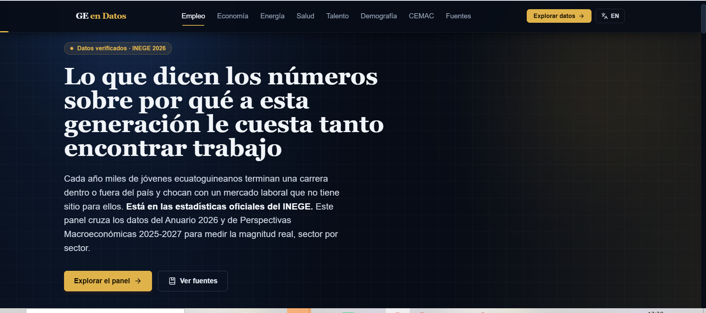

# GE en Datos

**A bilingual (Spanish/English) Business Intelligence dashboard on the socio-economic situation of Equatorial Guinea, built on official statistics from INEGE (Instituto Nacional de Estadistica de Guinea Ecuatorial).**

[](https://nextjs.org)
[](https://react.dev)
[](https://www.typescriptlang.org)
[](https://tailwindcss.com)
[](https://vitest.dev)
[](#pwa-and-offline-strategy)
[](#license)

**Live demo:** https://estadistica-dashboard-2026.vercel.app/



https://github.com/user-attachments/assets/a86211cb-788c-4b83-a704-bcdea3a20d31


> **Independent project.** This project is not affiliated with, endorsed by, or produced for INEGE or the Government of Equatorial Guinea. All figures come from public official publications and are cited by table or page. Interpretations are the author's own.

---

## Table of Contents

1. [Executive Summary](#executive-summary)
2. [Project Vision and Purpose](#project-vision-and-purpose)
3. [Key Features](#key-features)
4. [System Architecture](#system-architecture)
   - [Rendering Strategy](#rendering-strategy-app-router)
5. [Technology Stack](#technology-stack)
6. [Complete Folder and File Structure](#complete-folder-and-file-structure)
7. [Module-by-Module Breakdown](#module-by-module-breakdown)
8. [Data Governance and Statistical Sources](#data-governance-and-statistical-sources)
   - [Primary Sources](#primary-sources)
   - [Methodological Notes](#methodological-notes)
   - [Dataset by Sector](#dataset-by-sector)
9. [Design System](#design-system)
10. [Internationalization](#internationalization-i18n)
11. [PWA and Offline Strategy](#pwa-and-offline-strategy)
12. [Installation and Local Development](#installation-and-local-development)
13. [Available Scripts](#available-scripts)
14. [Testing Strategy](#testing-strategy)
15. [Code Quality and Linting](#code-quality-and-linting)
16. [Environment and Configuration Files](#environment-and-configuration-files)
17. [Deployment Guide](#deployment-guide)
18. [Performance and Observability](#performance-and-observability)
19. [Accessibility](#accessibility)
20. [Security Considerations](#security-considerations)
21. [Roadmap](#roadmap)
22. [Contributing Guidelines](#contributing-guidelines)
23. [Author](#author)
24. [License](#license)
25. [Resumen en espanol](#resumen-en-espanol)

---

## Executive Summary

**GE en Datos** is a bilingual web application built with **Next.js (App Router)** and **React** that turns national statistics from Equatorial Guinea into an interactive dashboard.

The data comes from two official INEGE publications:

- **Anuario Estadistico de Guinea Ecuatorial 2026** (Statistical Yearbook 2026)
- **Perspectivas Macroeconomicas 2025-2027** (Macroeconomic Outlook, June 2025)

The central question of the dashboard is what the numbers say about why this generation finds it so hard to get a job. It is organised in seven sections: **Employment, Economy, Energy, Health, Education, Demographics** and **CEMAC** regional benchmarking.

Each metric is sourced and table-referenced (for example, *Tabla 129*, *Tabla 59*). When two sources give different figures, or a figure is a preliminary estimate or projection, the dashboard labels it as such.

---

## Project Vision and Purpose

| Audience | Value |
|---|---|
| Recruiters and hiring managers | A full-stack project on a real dataset: React/Next.js architecture, TypeScript, data modelling, testing, PWA delivery and i18n. |
| Analysts and consultants | A source-audited snapshot of labour-market friction, macroeconomic trajectory, hydrocarbon output decline and health and safety indicators. |
| Public and civic-tech interest | Dense, PDF-locked national statistics made accessible, navigable and comparable with CEMAC peers. |

The author, **Pedro Fabian Owono Ondo Mangue**, is a Computer Engineer specialising in IT/OT integration and B2B consulting. The project is a bridge between software engineering and macroeconomic and industrial data literacy. It lives at `/dashboard`, behind a personal landing page at `/`.

---

## Key Features

- **Seven charted sections** built with Recharts, using a shared custom tooltip, animated bars and lines, and gradient theming.
- **Bilingual runtime i18n** (Spanish and English) through a custom React Context, with no external i18n library. The language defaults to Spanish on server and client and syncs from `localStorage` after mount, which avoids hydration mismatches.
- **Animated KPI counters** (`AnimatedNumber`) that parse Spanish-formatted numbers (for example `1,73M`, `13,7%`) and animate them into view with `IntersectionObserver` and `requestAnimationFrame`, without an animation library.
- **Scroll-triggered reveal animations** (`ScrollReveal`) with Framer Motion across all sections.
- **Enterprise-grid visual identity**: dark navy and gold palette, glass panels, aurora backgrounds and a subtle animated grid.
- **Progressive Web App**: service worker registration plus a versioned "what's new" notice (`UpdateNotification`) whose dismissal is stored in `localStorage`.
- **Back-to-top button** with scroll-based visibility and animated enter and exit.
- **Automated component testing** with Vitest and Testing Library (jsdom), including a `matchMedia` mock.
- **Strict TypeScript**: data contracts (`StatCardRaw`), typed translation keys (`TranslationKey = keyof typeof translations.es`) and typed component props.
- **Source transparency**: each chart shows an inline citation with the table number of the INEGE table it visualises.
- **CEMAC benchmarking** of Equatorial Guinea's GDP growth and inflation against the CEMAC zone average (BEAC data).
- **Accessibility-conscious markup**: semantic landmarks, `aria-label`s on interactive controls, keyboard-reachable toggles and `@axe-core/react` as a development dependency.

---

## System Architecture

The application is a static-data, client-interactive dashboard. Official figures are transcribed and cross-checked against table numbers (audit trail in `Estadistica.txt`), stored as typed modules in `src/data`, and rendered by section components under the Next.js App Router. Language state is provided by a React Context at the root layout, which also mounts the PWA helpers. The service worker and manifest are served from `public/`, and the app is hosted on Vercel with Analytics and Speed Insights.

### Rendering Strategy (App Router)

The app uses the **Next.js App Router** exclusively; there is no legacy `pages/` directory.

| Layer | Rendering mode | Rationale |
|---|---|---|
| `app/layout.tsx` | Server Component (root) | Hosts global providers, metadata and PWA manifest wiring without extra client JavaScript at the root. |
| `app/page.tsx` | Server Component | Static landing page. No interactivity beyond a `<Link>`. |
| `app/dashboard/page.tsx` | Server Component (thin wrapper) | Delegates interactivity to `DashboardHome`, keeping the route easy to prerender. |
| Section components (`EmpleoSection`, `EconomiaSection`, ...) | Client Components (`"use client"`) | Recharts, Framer Motion and `IntersectionObserver` hooks depend on the browser. |
| `LanguageContext`, `AnimatedNumber`, `ScrollReveal`, `ChartTooltip` | Client Components | Stateful, effectful or event-driven. |

The result is a server-first shell with narrowly scoped client boundaries.

---

## Technology Stack

Exact versions are defined in `package.json`; the tables below reflect it.

### Core Framework

| Technology | Version | Purpose |
|---|---|---|
| Next.js | 16.3.6 | App Router, SSR/RSC, routing, metadata API, build pipeline |
| React and React DOM | 19.2.8 | UI runtime and rendering |
| TypeScript | ^5 | Static typing of data contracts, components and translation keys |

### UI and Styling

| Technology | Version | Purpose |
|---|---|---|
| Tailwind CSS | ^3.4.19 | Utility-first styling and custom `brand-*` design tokens |
| PostCSS | ^8.5.28 | CSS transformation pipeline |
| Autoprefixer | ^10.6.1 | Vendor prefixing |
| Framer Motion | ^13.4.4 | Scroll-reveal transitions and `AnimatePresence` |
| Lucide React | ^1.48.0 | Icon system |
| clsx and tailwind-merge | ^2.1.1 / ^3.7.0 | Conditional and conflict-safe class composition |
| cobe | ^2.0.1 | WebGL globe (landing page visual) |

### Data Visualization

| Technology | Version | Purpose |
|---|---|---|
| Recharts | ^3.10.1 | Bar and line charts with custom cells, legends and tooltips |

### Testing and Quality

| Technology | Version | Purpose |
|---|---|---|
| Vitest | ^5.0.2 | Test runner |
| @vitejs/plugin-react | ^6.1.1 | JSX/TSX transform for Vitest |
| @testing-library/react | ^16.3.3 | Component rendering and queries |
| @testing-library/dom | ^10.4.2 | DOM utilities |
| @testing-library/jest-dom | ^7.0.1 | Extended DOM matchers |
| jsdom | ^29.1.1 | Simulated browser environment |
| @axe-core/react | ^4.13.0 | Runtime accessibility auditing |
| ESLint and eslint-config-next | ^9 / 16.3.6 | Static analysis |

### Tooling and Developer Experience

| Technology | Version | Purpose |
|---|---|---|
| Vite | ^8.3.1 | Tooling engine behind Vitest |
| @vercel/analytics | ^2.0.1 | Traffic analytics |
| @vercel/speed-insights | ^2.0.0 | Real-user Core Web Vitals |
| @emailjs/browser | ^4.4.1 | Client-side contact integration (landing page) |

---

## Complete Folder and File Structure

```text
pedro-portfolio-2026/
│
├── public/                                    # Static assets (manifest.json, sw.js, icons)
│
├── src/
│   ├── app/                                   # Next.js App Router root
│   │   ├── dashboard/
│   │   │   └── page.tsx                       # /dashboard route, renders <DashboardHome />
│   │   ├── favicon.ico                        # Site favicon
│   │   ├── globals.css                        # Design tokens, keyframes, utility layers
│   │   ├── layout.tsx                         # Root layout: metadata, providers, PWA hooks
│   │   └── page.tsx                           # "/" landing page
│   │
│   ├── components/
│   │   ├── __tests__/
│   │   │   └── Header.test.tsx                # Vitest + RTL test for <Header />
│   │   │
│   │   ├── dashboard/                         # Dashboard-specific components
│   │   │   ├── AnimatedNumber.tsx             # Count-up KPI animation (ES-format aware)
│   │   │   ├── BackToTop.tsx                  # Floating scroll-to-top control
│   │   │   ├── CemacSection.tsx               # GE vs. CEMAC comparison charts
│   │   │   ├── ChartTooltip.tsx               # Shared custom Recharts tooltip
│   │   │   ├── DashboardHome.tsx              # Section orchestrator
│   │   │   ├── DemografiaSection.tsx          # Population density and household size
│   │   │   ├── EconomiaSection.tsx            # GDP growth and inflation
│   │   │   ├── EducacionSection.tsx           # Literacy, enrolment, graduates
│   │   │   ├── EmpleoSection.tsx              # Unemployment by education level
│   │   │   ├── EnergiaSection.tsx             # Electricity generation mix
│   │   │   ├── Footer.tsx                     # Footer (sources, credits)
│   │   │   ├── Header.tsx                     # Sticky nav, language toggle, mobile menu
│   │   │   ├── Hero.tsx                       # Hero with 4 animated KPI cards
│   │   │   ├── SaludSection.tsx               # Malaria, HIV, road-traffic indicators
│   │   │   └── ScrollReveal.tsx               # Framer Motion viewport reveal wrapper
│   │   │
│   │   ├── ServiceWorkerRegistry.tsx          # Registers /sw.js on window 'load'
│   │   └── UpdateNotification.tsx             # Versioned "what's new" notice
│   │
│   ├── context/
│   │   └── LanguageContext.tsx                # ES/EN state and t() translator
│   │
│   ├── data/
│   │   ├── dashboardData.ts                   # Typed, source-annotated INEGE datasets
│   │   └── translations.ts                    # ES/EN dictionary (typed keys)
│   │
│   └── test/
│       └── setup.ts                           # Vitest global setup
│
├── .gitignore                                 # VCS ignore rules
├── AGENTS.md                                  # Guidance file for AI coding agents
├── CLAUDE.md                                  # Pointer file (@AGENTS.md)
├── eslint.config.mjs                          # Flat ESLint config
├── Estadistica.txt                            # Data extraction and audit trail (INEGE tables)
├── imagenView.png                             # Dashboard screenshot used in this README
├── next.config.ts                             # Next.js configuration
├── package.json                               # Dependencies, scripts, metadata
├── postcss.config.js                          # PostCSS config (Tailwind 3 style)
├── postcss.config.mjs                         # PostCSS config (@tailwindcss/postcss style)
├── README.md                                  # This file
├── ScreenRecord.mp4                           # Optional local copy of the demo video
├── tailwind.config.js                         # Design tokens, fonts, keyframes
├── tsconfig.json                              # TypeScript config and path aliases
└── vitest.config.mts                          # Vitest configuration
```

`.next/` and `node_modules/` are generated folders and are not part of the source tree; `manifest.json` and `sw.js` live under `public/`.

---

## Module-by-Module Breakdown

### `src/app` (application routes)

| File | Responsibility |
|---|---|
| `layout.tsx` | Root `<html>` and `<body>`, `metadata` (title, description, keywords, authors, manifest), wraps the tree in `LanguageProvider` and mounts `UpdateNotification` and `ServiceWorkerRegistry`. |
| `page.tsx` | Public landing page (`/`) presenting the author (Computer Engineer, IT/OT integration, B2B consulting) with a call to action linking to `/dashboard`. |
| `dashboard/page.tsx` | Dashboard entry route (`/dashboard`), a composition wrapper rendering `<DashboardHome />`. |
| `globals.css` | `enterprise-grid` background, `.glass-panel`, `.chart-card`, `.stat-card`, gradient text utilities, custom scrollbars and the `step-in` keyframe used by `UpdateNotification`. |

### `src/components/dashboard` (dashboard modules)

Every analytical section follows the same contract:

1. Import typed datasets from `dashboardData.ts`.
2. Map raw keys (for example `nivelKey: 'esba'`) through `t()` to get the active-language label.
3. Wrap the heading in `<ScrollReveal>`.
4. Render a two-column grid: a `chart-card` (Recharts chart plus inline source citation) and a stack of colour-coded insight callouts.

| Component | Chart type | Metric focus |
|---|---|---|
| `EmpleoSection` | Vertical `BarChart` | Unemployment rate by education level (ESBA, Bachillerato, Tecnica, Universitario) |
| `EconomiaSection` | `LineChart` | Real GDP growth, 2021-2024 and projections 2025-2027 |
| `EnergiaSection` | Bar/Pie composition | Electricity generation: renewable vs. non-renewable |
| `SaludSection` | Stat cards and charts | Malaria prevalence, HIV by gender, road-traffic indicators |
| `EducacionSection` | Horizontal `BarChart` | Foreign-university graduates by field (STEM vs. social sciences) |
| `DemografiaSection` | HTML table and progress bars | Population density and household size by region |
| `CemacSection` | Grouped `BarChart` | Equatorial Guinea vs. CEMAC average (GDP growth, inflation, 2024) |

Shared primitives:

- **`AnimatedNumber.tsx`** parses locale-formatted strings (`"1,73M"`, `"13,7%"`, `"44.578"`) into `{ numeric, decimals, suffix }` and animates the number from 0 with a cubic ease-out driven by `requestAnimationFrame`. It fires once through `IntersectionObserver` (`threshold: 0.4`) and does not replay.
- **`ChartTooltip.tsx`** is one reusable Recharts tooltip (`active`, `payload`, `label`, optional `unit` and `formatValue`) for visual consistency.
- **`ScrollReveal.tsx`** is a thin Framer Motion wrapper for fade and slide entrance, with a `delay` prop for staggered reveals.
- **`Header.tsx`** is a sticky navigation bar with anchor links to all sections, a language toggle and a mobile menu; it is covered by `Header.test.tsx`.
- **`Hero.tsx`** is the above-the-fold section: headline thesis, supporting text, a verified-data badge and four `AnimatedNumber` KPI cards.
- **`Footer.tsx`** closes the page with data provenance and author credit.
- **`BackToTop.tsx`** is a floating button shown when `window.scrollY > 640`, using a passive scroll listener.

### `src/context` (global state)

`LanguageContext.tsx` is a small, dependency-free i18n runtime:

- `language` starts as `'es'` on both server and client to keep hydration consistent.
- A `useEffect` reads `localStorage.getItem('portfolio_lang')` after mount only.
- A second `useEffect` writes changes back to `localStorage` and sets `document.documentElement.lang`.
- It exposes `t(key: TranslationKey): string`, so an invalid key is a compile-time error.

### `src/data` (data and i18n layer)

- **`dashboardData.ts`**: every exported constant has an inline source comment naming the INEGE table (for example `// Fuente: Anuario 2026, Tabla 129`). Data shapes use language-neutral keys (`ramaKey: 'sociales'`) so data is decoupled from display language.
- **`translations.ts`**: one dictionary `{ es: {...}, en: {...} }`. `TranslationKey` is `keyof typeof translations.es`, so the English object must implement every Spanish key.

### `src/test` (test harness)

`setup.ts` bootstraps Vitest with jsdom and `@testing-library/jest-dom` matchers.

---

## Data Governance and Statistical Sources

### Primary Sources

| Source | Publisher | Coverage |
|---|---|---|
| Anuario Estadistico de Guinea Ecuatorial 2026 | INEGE | Employment, health, education, demographics, energy, road-traffic safety |
| Perspectivas Macroeconomicas 2025-2027 (June 2025) | INEGE | GDP, inflation, fiscal and external outlook, hydrocarbon production forecasts |
| BEAC, Monetary Policy Committee (March 2025), as cited in Perspectivas | Banque des Etats de l'Afrique Centrale | CEMAC benchmark: regional GDP growth, inflation, policy rate |

### Methodological Notes

1. **GDP series.** Real GDP growth follows Table 1C of *Perspectivas*: 2021 +0.9%, 2022 +3.2%, 2023 -5.1%, 2024 +0.9% (estimate). Values for 2025 (-1.6%), 2026 (+0.2%) and 2027 (+1.2%) are **projections**, not observed data.
2. **CEMAC comparison.** Both sides use the same year (2024): GDP growth 0.9% for Equatorial Guinea vs. 2.6% for CEMAC; average inflation 3.4% vs. 4.1%.
3. **Hydrocarbons.** INEGE reports a cumulative production loss of 11.0% between 2024 (226,790 bbl/day) and 2027 (208,004 bbl/day). Those two endpoints alone imply about 8.3%. The dashboard shows INEGE's wording together with the absolute figures.
4. **Road-traffic scope.** The figure of 478 accidents in 2025 corresponds to the traffic authority of Bioko Norte, not to a national total, and is labelled accordingly. Related tables: Tabla 225 (Bioko Norte) and Tabla 227 (Litoral and Bioko Sur). Fire statistics come from Tabla 119.
5. **Population density.** The 44 inhabitants/km2 figure is based on the 2015 census (Tabla 23) and is labelled as such; it is not derived from the 2025 population estimate.
6. **Source revisions.** Preliminary and consolidated figures can differ between publications. Where this happens, each figure carries its own source label instead of being merged into one number.

<!-- VERIFY BEFORE PUBLISHING: any 2025 GDP figure quoted from the Anuario (if different from Perspectivas), energy units in Tabla 16 / 243 / 245, and table numbers for accidents. -->

### Dataset by Sector

#### 1. Employment and Labour Market

| Indicator | Value | Source |
|---|---|---|
| Unemployment, ESBA (basic secondary) | 32.9% | Anuario 2026, Tabla 129 |
| Unemployment, Bachillerato | 19.7% | Anuario 2026, Tabla 129 |
| Unemployment, technical and vocational training | 18.2% | Anuario 2026, Tabla 129 |
| Unemployment, university graduates | 4.4% | Anuario 2026, Tabla 129 |
| Job search through personal contacts or family | 45.0% | Anuario 2026, Tabla 128 |
| Job search directly through employers | 19.8% | Anuario 2026, Tabla 128 |
| Job search through radio, TV or internet ads | 9.9% | Anuario 2026, Tabla 128 |
| Job search through the public employment office (MTFE) | 3.6% | Anuario 2026, Tabla 128 |
| National unemployment rate (headline KPI) | 13.7% | ENH2 2023 |
| Informal employment share | 83.0% | Tabla 123 |
| Population living in poverty | 50.7% | Tabla 160 |

#### 2. Macroeconomy and Investment Climate

| Indicator | Value | Source |
|---|---|---|
| Real GDP growth 2021 | +0.9% | Perspectivas 2025-2027, Grafico 11 |
| Real GDP growth 2022 | +3.2% | Perspectivas 2025-2027, Grafico 11 |
| Real GDP growth 2023 | -5.1% | Perspectivas 2025-2027, Tabla 1C |
| Real GDP growth 2024 (estimate) | +0.9% | Perspectivas 2025-2027, Tabla 1C |
| Real GDP growth 2025 (projection) | -1.6% | Perspectivas 2025-2027, Tabla 1C |
| Real GDP growth 2026 (projection) | +0.2% | Perspectivas 2025-2027, Tabla 1C |
| Real GDP growth 2027 (projection) | +1.2% | Perspectivas 2025-2027, Tabla 1C |
| Average inflation 2024 | 3.4% | Perspectivas 2025-2027, section 3.2 |
| Inflation forecast 2025 | 2.8% | Perspectivas 2025-2027, section 4.2 |
| Inflation forecast 2026-2027 | 2.6% | Perspectivas 2025-2027, section 4.2 |
| Monthly inflation, Jan/Feb/Apr 2025 | 3.4% | Anuario 2026, Tabla 158 |
| Monthly inflation, March 2025 (peak) | 3.5% | Anuario 2026, Tabla 158 |
| Monthly inflation, December 2025 (closing) | 2.3% | Anuario 2026, Tabla 158 |
| Fiscal deficit, % of GDP, 2024 to 2027 | -0.6% to -2.1% | Perspectivas 2025-2027, section 4.3 |
| Current account balance, % of GDP, 2024 to 2027 | -5.2% to -8.3% | Perspectivas 2025-2027, section 4.4 |

#### 3. Energy, Hydrocarbons and Industry

| Indicator | Value | Source |
|---|---|---|
| Total electricity generation, 2025 | 1,234,334.0 kW | Anuario 2026, Tabla 16 |
| Non-renewable generation, 2025 | 679,174.0 kW | Anuario 2026, Tabla 16 |
| Renewable generation, 2025 | 555,160.0 kW | Anuario 2026, Tabla 16 |
| Non-renewable monthly peak (March 2025) | 70,738 MW | Anuario 2026, Tabla 243/245 |
| Non-renewable monthly peak (April 2025) | 65,652 MW | Anuario 2026, Tabla 243/245 |
| Renewable monthly peak (December 2025) | 51,234 MW | Anuario 2026, Tabla 243/245 |
| Hydrocarbon daily production, 2024 | 226,790 bbl/day | Perspectivas 2025-2027, p. 38 |
| Hydrocarbon daily production, 2027 (projection) | 208,004 bbl/day | Perspectivas 2025-2027, p. 38 |
| Cumulative change as reported by INEGE | -11.0% (endpoints imply about -8.3%) | Perspectivas 2025-2027, p. 38 |
| Crude oil, cumulative trend 2025-2027 | +5.5% (reconnection of wells in the Zafiro field) | Perspectivas 2025-2027, p. 40 |
| Condensate, cumulative trend 2025-2027 | -33.5% (maturation of the Alba and Alen blocks) | Perspectivas 2025-2027, p. 40 |
| Other gases, cumulative trend | -29.0% (end of methanol production) | Perspectivas 2025-2027, p. 40 |
| National vehicle fleet, 2025 | 33,837 (16,440 Continental, 17,397 Insular) | Anuario 2026 |
| Tuna processing plant, Annobon (planned) | up to 74,150 tonnes/year | Perspectivas 2025-2027, p. 50 |

<!-- VERIFY: energy units (kW/MW vs kWh/MWh) against the Anuario tables. -->

#### 4. Public Health and Safety

| Indicator | Value | Source |
|---|---|---|
| Malaria (simple), hospital-notified cases, 2025 | 44,578 | Anuario 2026, Tabla 59 |
| Malaria (complicated), hospital-notified cases, 2025 | 10,739 | Anuario 2026, Tabla 59 |
| Salmonellosis, hospital-notified cases, 2025 | 43,623 | Anuario 2026, Tabla 59 |
| Malaria prevalence, Bioko Island, general population, 2025 | 7.5% | Anuario 2026, Tabla 48 |
| Malaria prevalence, rural areas of Bioko | 16.8% | Anuario 2026, Tabla 48 |
| Malaria prevalence, urban areas of Bioko | 6.6% | Anuario 2026, Tabla 48 |
| Most-reported health condition: malaria | 37.9% | Anuario 2026, Tabla 44 |
| Second: typhoid fever | 23.6% | Anuario 2026, Tabla 44 |
| Third: acute respiratory infections | 13.0% | Anuario 2026, Tabla 44 |
| New HIV cases, 2024 | 4,382 | Anuario 2026, Tabla 54/55 |
| New HIV cases, women over 15 | 2,260 | Anuario 2026, Tabla 55 |
| New HIV cases, men over 15 | 1,501 | Anuario 2026, Tabla 55 |
| New HIV cases, children | 621 | Anuario 2026, Tabla 55 |
| People living with HIV, 2024 | 72,257 | Anuario 2026, Tabla 54 |
| Traffic accidents, Bioko Norte, 2025 | 478 (17 fatalities, 130 injured) | Anuario 2026, Tabla 225 |
| Traffic accidents, Litoral (Continental), 2025 | 260 (6 fatalities, 29 injured) | Anuario 2026, Tabla 227 |
| Traffic accidents, Bioko Sur, 2025 | 5 | Anuario 2026, Tabla 227 |
| Fires, 2025 | 174 (21 industrial, 13 vehicle; 310 dwellings affected) | Anuario 2026, Tabla 119 |

> **Scope qualifier:** the 478-accident figure is a Bioko Norte statistic, not a national total. See [Methodological Notes](#methodological-notes).

#### 5. Education and Human Capital

| Indicator | Value | Source |
|---|---|---|
| National literacy rate (15+), 2023 | 90.1% (men 95.2%, women 85.6%) | Anuario 2026, Tabla 60 |
| Literacy, Insular region | 96.6% (men 97.1%, women 96.1%) | Anuario 2026, Tabla 60 |
| Literacy, Continental region | 87.6% (men 94.4%, women 81.6%) | Anuario 2026, Tabla 60 |
| Vocational training enrolment, 2020-2021 | 5,428 (3,233 women, 2,195 men) | Anuario 2026, Tabla 92 |
| National university enrolment, 2024-2025 | 12,121 (6,166 men, 5,955 women) | Anuario 2026, Tabla 98 |
| Largest faculty: Humanities and Religious Sciences | 2,658 | Anuario 2026, Tabla 98 |
| Second: Economics, Management and Administration | 2,475 | Anuario 2026, Tabla 98 |
| STEM faculty: Engineering, Architecture, Agricultural Technology and Fisheries | 1,577 | Anuario 2026, Tabla 98 |
| Homologated foreign-university graduates, 2023 | 218 (88 women, 130 men) | Anuario 2026, Tabla 100 |
| of which Social Sciences, Administration and Law | 124 (57 women, 67 men) | Anuario 2026, Tabla 100 |
| of which Engineering and related professions | 32 (7 women, 25 men) | Anuario 2026, Tabla 100 |
| of which Computer Science | 14 (3 women, 11 men) | Anuario 2026, Tabla 100 |

> **Structural observation:** about 21% of homologated foreign graduates come from Engineering and Computer Science combined (46 of 218), against about 57% from Social Sciences and Law (124 of 218).

#### 6. Demographics

| Indicator | Value | Source |
|---|---|---|
| Total population, 2025 | 1.73 million (+3.4% annual growth) | Anuario 2026 |
| National population density | 44 inhabitants/km2 (2015 census basis) | Anuario 2026, Tabla 23 |
| Insular region density | 167 inhabitants/km2 | Anuario 2026, Tabla 23 |
| Bioko Norte density (highest) | 387 inhabitants/km2 | Anuario 2026, Tabla 23 |
| Continental region density | 34 inhabitants/km2 | Anuario 2026, Tabla 23 |
| Litoral province density | 55 inhabitants/km2 | Anuario 2026, Tabla 23 |
| Average household size, 2023 | 4.0 members | Anuario 2026, Tabla 24 |
| Continental region household size | 4.1 members | Anuario 2026, Tabla 24 |
| Insular region household size | 3.7 members | Anuario 2026, Tabla 24 |

#### 7. CEMAC Regional Benchmark (2024)

| Indicator | Equatorial Guinea | CEMAC average | Source |
|---|---|---|---|
| Real GDP growth | 0.9% | 2.6% | Perspectivas 2025-2027 (BEAC, CPM March 2025) |
| Average inflation | 3.4% | 4.1% | Perspectivas 2025-2027 (BEAC, CPM March 2025) |
| BEAC policy rate (TIAO) | not applicable | 5.0% | Perspectivas 2025-2027 (BEAC) |

---

## Design System

The visual identity follows an institutional financial-dashboard style, defined by tokens in `tailwind.config.js`:

```js
colors: {
  'brand-bg':          '#070c16',  // Deep navy base background
  'brand-panel':       '#101b30',  // Card and panel surface
  'brand-panel-light': '#16233c',  // Hover and elevated surface
  'brand-border':      '#22314c',  // Hairline borders
  'brand-gold':        '#e0b34a',  // Primary accent: CTAs, highlights, active states
}
```

| Token or utility | Purpose |
|---|---|
| `.glass-panel` | Backdrop-blurred, semi-transparent panel for elevated containers |
| `.chart-card` | Container for every chart, with a hover lift and gold border glow |
| `.stat-card` | KPI container with a subtle hover shift |
| `.gradient-text` / `.gradient-text-gold` | Blue and gold gradient text for headline emphasis |
| `.bg-enterprise-grid` | Root background of layered radial gradients and a fine animated grid |
| `.aurora-blob` | Large blurred gradient shapes for ambient depth |
| Custom scrollbars | Gold-on-navy scrollbars for brand consistency |
| `font-serif` | Editorial tone for section titles |
| `Orbitron` (`font-cyber`) and `Rajdhani` (`font-tech`) | Reserved for landing-page brand typography |

Insight callouts use a consistent semantic colour system, always accompanied by a text label:

- **Red border:** risk or negative trend (high unemployment, GDP contraction, hydrocarbon decline)
- **Amber border:** caution or structural imbalance (informal employment, STEM gap)
- **Emerald border:** positive signal (low graduate unemployment, renewable energy)

---

## Internationalization (i18n)

The i18n system is hand-built, dependency-free and type-safe, chosen over `next-intl` or `react-i18next` to keep the bundle small and the translation contract compile-time verifiable.

1. `translations.ts` exports `{ es: { ...keys }, en: { ...keys } }`.
2. `TranslationKey` is `keyof typeof translations.es`, so the English object must define every Spanish key; a missing key is a TypeScript error.
3. Components use `const { t } = useLanguage()` and call `t('section.key')`.
4. Data-driven keys (for example `t(\`empleo.level.${d.nivelKey}\`)`) are cast with `as TranslationKey`, keeping dataset values independent of any display language.
5. Language defaults to `'es'` on server and client, hydrates from `localStorage.getItem('portfolio_lang')` after mount, and persists on every toggle.
6. `document.documentElement.lang` is kept in sync for accessibility and SEO.

Coverage includes navigation, hero copy, section titles and descriptions, chart titles and source citations, insight callouts, table headers and the update-notification text.

---

## PWA and Offline Strategy

| Mechanism | Implementation |
|---|---|
| Manifest | Linked with `metadata.manifest = "/manifest.json"` in `app/layout.tsx`, enabling installation on mobile and desktop. |
| Service worker registration | `ServiceWorkerRegistry.tsx` runs client-side only, waits for the `load` event and registers `/sw.js`, logging success or failure without blocking rendering. |
| Versioned release notes | `UpdateNotification.tsx` holds a `CURRENT_VERSION` constant. On mount it compares it with `localStorage.getItem('portfolio_version')` and, if the visitor has not seen the release, shows a dismissible notice (after a 2-second delay) with up to four translated notes (`update.note1` to `update.note4`). Dismissal stores the version. |

---

## Installation and Local Development

### Prerequisites

- Node.js 18.18 or newer
- npm, yarn, pnpm or bun

### Setup

```bash
# 1. Clone the repository
git clone <repository-url>
cd pedro-portfolio-2026

# 2. Install dependencies
npm install

# 3. Start the development server
npm run dev

# 4. Open the app
# Landing page:  http://localhost:3000
# Dashboard:     http://localhost:3000/dashboard
```

The dev server supports Fast Refresh, including edits to `dashboardData.ts` and `translations.ts`.

---

## Available Scripts

| Command | Description |
|---|---|
| `npm run dev` | Start the Next.js development server |
| `npm run build` | Create an optimized production build |
| `npm run start` | Serve the production build (run `build` first) |
| `npm run lint` | Run ESLint |
| `npm run test` | Run the Vitest suite once |
| `npm run test:watch` | Run Vitest in watch mode |

---

## Testing Strategy

Tests use **Vitest**, configured in `vitest.config.mts` with the `jsdom` environment, `@vitejs/plugin-react` and the `@/*` alias mirrored from `tsconfig.json`.

**Current coverage**

- `Header.test.tsx` renders `<Header />` inside `<LanguageProvider>`, mocks `window.matchMedia`, checks that a `<nav>` element exists and that core navigation copy (for example "Empleo") renders.

**Conventions**

- Tests wrap components in their real context providers instead of mocking them.
- Browser API mocks use `Object.defineProperty(window, ...)`.
- Assertions prefer semantic queries over snapshots.

**Next steps** (see [Roadmap](#roadmap)): unit tests for `parseValue` and `formatNumber` in `AnimatedNumber`, and for `LanguageContext` toggle and persistence.

---

## Code Quality and Linting

- **ESLint** uses the flat config (`eslint.config.mjs`), composing the `core-web-vitals` and `typescript` rule sets from `eslint-config-next`.
- Default Next.js ignores (`.next/**`, `out/**`, `build/**`, `next-env.d.ts`) are re-declared with `globalIgnores`.
- **TypeScript strict mode** is enabled, together with `isolatedModules`, `esModuleInterop` and `resolveJsonModule`.
- The `@/*` alias (mapped to `./src/*`) is used throughout instead of long relative paths.

---

## Environment and Configuration Files

| File | Purpose |
|---|---|
| `next.config.ts` | Next.js configuration (currently minimal) |
| `tsconfig.json` | Compiler target `ES2017`, `bundler` module resolution, `react-jsx`, `@/*` alias, inclusion of Vitest files |
| `postcss.config.js` / `postcss.config.mjs` | Two PostCSS configurations exist: the `.js` file targets the classic `tailwindcss` plus `autoprefixer` pair, the `.mjs` file targets `@tailwindcss/postcss`. Keep only the one matching the installed Tailwind major version. |
| `tailwind.config.js` | Design tokens (colours, fonts, keyframes, animations) |
| `eslint.config.mjs` | Flat ESLint configuration |
| `vitest.config.mts` | Test runner configuration |
| `AGENTS.md` / `CLAUDE.md` | Guidance files for AI coding agents, generated by Next.js tooling |
| `Estadistica.txt` | Raw data-extraction notes and audit trail |
| `.gitignore` | Standard Next.js ignore rules |

---

## Deployment Guide

The project is deployed on **Vercel**, the reference platform for Next.js, which matches the use of `@vercel/analytics` and `@vercel/speed-insights`.

### Deploying to Vercel

1. Push the repository to GitHub, GitLab or Bitbucket.
2. Import it at [vercel.com/new](https://vercel.com/new).
3. Vercel detects Next.js and applies the correct build settings.
4. Add any required environment variables (for example EmailJS keys, if the contact flow is live) in the project settings.
5. Deploy. Later pushes to the tracked branch trigger new production or preview deployments.

### Self-hosting

```bash
npm run build
npm run start
# Serves on http://localhost:3000 by default
```

### Static or container deployment

Both routes are Server Components without dynamic server-side data fetching, since all datasets are bundled TypeScript modules. This makes the app a candidate for static export or containerised deployment behind Nginx or Caddy, provided `/sw.js` and `/manifest.json` are served from the web root.

---

## Performance and Observability

- `@vercel/speed-insights` captures real-user Core Web Vitals (LCP, INP, CLS).
- `@vercel/analytics` provides lightweight, cookie-free traffic analytics.
- `AnimatedNumber` and `ScrollReveal` defer their work with `IntersectionObserver`, so off-screen elements do not use animation frames.
- `BackToTop` uses passive scroll listeners.
- Server-first rendering at route level keeps the initial HTML small, with hydration limited to interactive subtrees.

---

## Accessibility

- Semantic landmarks (`<nav>`, `<section>`) and a consistent heading hierarchy.
- Interactive controls carry `aria-label`s (for example on `BackToTop`, `UpdateNotification` and the `Header` menu).
- `document.documentElement.lang` follows the active language.
- `@axe-core/react` is included as a development dependency for WCAG checks in the browser console.
- Colour-coded callouts are paired with text labels, not colour alone.

---

## Security Considerations

- No secrets or credentials are in the data layer. All figures come from public official publications.
- Service worker registration has explicit error handling.
- `localStorage` is used only for non-sensitive UI preferences (`portfolio_lang`, `portfolio_version`).
- Dependencies use caret ranges in `package.json`; commit the lockfile for reproducible installs.

---

## Roadmap

- [ ] Tests for `AnimatedNumber` parsing and formatting, and for `LanguageContext` persistence.
- [ ] A structured JSON pipeline or CMS so new INEGE yearbooks can be ingested without editing TypeScript.
- [ ] A dedicated **Fuentes** (sources) page consolidating all citations (the `nav.fuentes` key already exists).
- [ ] More CEMAC member states in the benchmark (Cameroon, Gabon, Congo, Chad, CAR).
- [ ] End-to-end tests with Playwright for the language toggle and PWA install.
- [ ] Machine-readable JSON/CSV export of the datasets.

---

## Contributing Guidelines

This is mainly a personal project, but corrections and structural contributions are welcome.

1. **Data changes require a citation.** Any change to `dashboardData.ts` must include an inline comment naming the exact table, document and year.
2. **i18n parity is mandatory.** Every key added to `translations.es` must be added to `translations.en` in the same commit; the compiler enforces it.
3. **New sections follow the existing contract**: `ScrollReveal` wrapper, `chart-card` and insight callouts.
4. **Run `npm run lint` and `npm run test`** before opening a pull request.
5. **Read `AGENTS.md`** before changing anything framework-related, given Next.js 16 changes.

---

## Author

**Pedro Fabian Owono Ondo Mangue**
Computer Engineer, IT/OT integration and B2B consulting.

This project is both a public analytical resource on Equatorial Guinea's socio-economic indicators and a technical showcase of modern React and Next.js practices.

---

## License

Source code is released under the **MIT License**. The underlying statistics remain the property of **INEGE** and the relevant authorities of Equatorial Guinea, and are reproduced for informational, educational and analytical purposes with full attribution.

```text
MIT License

Copyright (c) 2026 Pedro Fabian Owono Ondo Mangue

Permission is hereby granted, free of charge, to any person obtaining a copy
of this software and associated documentation files (the "Software"), to deal
in the Software without restriction, including without limitation the rights
to use, copy, modify, merge, publish, distribute, sublicense, and/or sell
copies of the Software, subject to the following conditions:

The above copyright notice and this permission notice shall be included in
all copies or substantial portions of the Software.

THE SOFTWARE IS PROVIDED "AS IS", WITHOUT WARRANTY OF ANY KIND, EXPRESS OR
IMPLIED, INCLUDING BUT NOT LIMITED TO THE WARRANTIES OF MERCHANTABILITY,
FITNESS FOR A PARTICULAR PURPOSE AND NONINFRINGEMENT.
```

---

## Resumen en espanol

**GE en Datos** es un dashboard bilingue (espanol e ingles) con estadisticas oficiales de Guinea Ecuatorial (INEGE y BEAC) sobre empleo, economia, energia, salud, educacion, demografia y comparacion con la CEMAC. Cada grafico cita la tabla de origen y las proyecciones se marcan como tales. Es un proyecto personal e independiente, sin vinculacion con INEGE ni con el Gobierno de Guinea Ecuatorial.

<p align="center">
  <sub>Built with Next.js, React and TypeScript. Data from INEGE (Anuario Estadistico 2026, Perspectivas Macroeconomicas 2025-2027) and BEAC.</sub>
</p>
